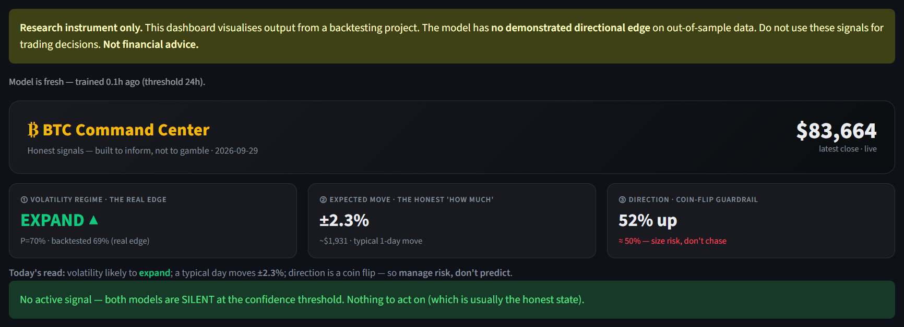
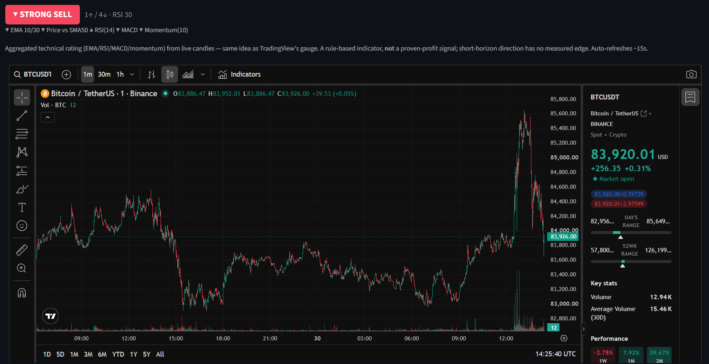
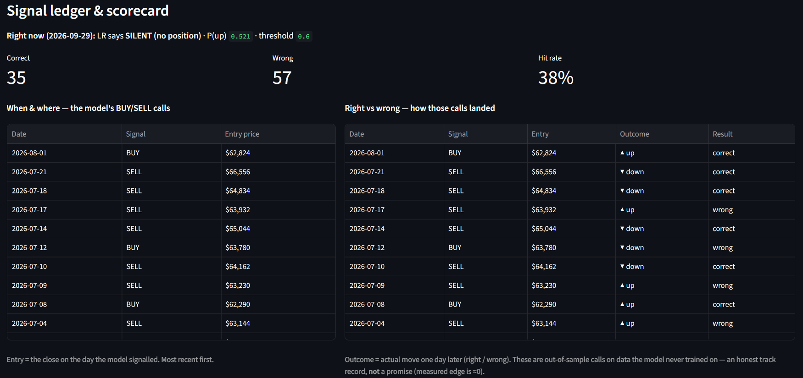
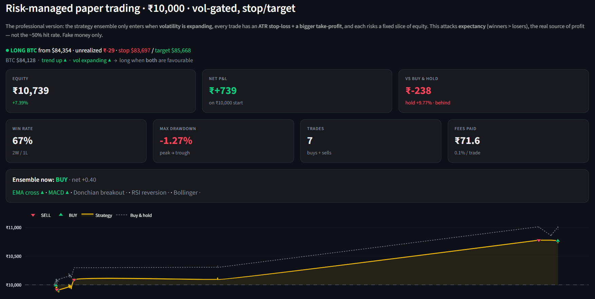
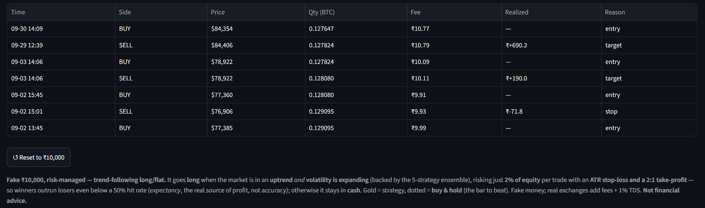

<div align="center">

# ₿ BTC Price And Behaviour Indicator

**A leakage-proof research pipeline and live Streamlit command center for BTC/USDT — built to tell the truth and spread awareness not to sell a strategy.**

[](https://github.com/Abhinav-Malik-154/Indicator/actions/workflows/ci.yml)


[](LICENSE.md)


[Dashboard guide](DASHBOARD.md) · [Methodology](PHASES.md) · [Monitoring](MONITORING.md) · [Contributing](CONTRIBUTING.md) · [License](LICENSE.md)



</div>

A 7-phase research project studying short-horizon BTC/USDT price prediction.
The goal was to build a price-direction indicator with production-grade
leakage prevention, rigorous out-of-sample evaluation, and honest reporting
— including the honest finding that the model has **no demonstrated
directional edge**.

This project exists to show how to do this kind of work correctly, not to
sell a winning trading strategy.

> [!WARNING]
> **Research and forward-testing project.** The current evidence does not
> demonstrate a directional edge. Do not use this project as financial advice
> or as an automated trading system.

## At A Glance

| Area | Summary |
|---|---|
| Scope | BTC/USDT daily price-direction research |
| Validation | Chronological walk-forward splits with leakage controls |
| Models | Logistic regression and LightGBM |
| Current finding | No demonstrated out-of-sample directional edge |
| Dashboard | Streamlit command center: live TradingView chart, signal scorecard, risk-managed paper trading |
| Quality | 560 tests, ruff lint, CI on every push |

## ✨ What's New in the Dashboard

The dashboard has been rebuilt from a plain signal readout into a full
**command center** — darker, denser, Binance-style, and still honest about
what the model can and cannot do.

| Upgrade | What it gives you |
|---|---|
| ₿ **Command Center header** | Live price plus three honest KPI cards — volatility regime (the real edge), expected move (the honest "how much"), and a coin-flip guardrail on direction |
| 📈 **Live TradingView chart** | Real streaming candles with a 1m → 1W timeframe switcher, market picker and light/dark toggle |
| 🚦 **Live signal call** | STRONG BUY → STRONG SELL rating from EMA, SMA, RSI, MACD and momentum, auto-refreshing every ~15s |
| 📋 **Signal ledger & scorecard** | Every out-of-sample BUY/SELL call next to how it actually landed, with a live correct / wrong / hit-rate tally |
| 💼 **Risk-managed paper trading** | ₹10,000 fake-money account: volatility-gated entries, ATR stop-loss, 2:1 take-profit, fees included, benchmarked against buy-and-hold |
| 🔁 **Validated retrain** | One-click retrain that only promotes a new model if it passes the leak-tripwire gate, with an audit log |

## 🖥️ Dashboard Preview

The dashboard is the project's operational view for live candles, model
signals, historical scorecards, volatility context, and the leakage-immune
forward test.

<table>
  <tr>
    <td colspan="2">
      <b>📈 Live chart + signal call</b><br/>
      <sub>TradingView candles with an auto-refreshing technical rating. A transparent rule-based indicator, not a proven-profit signal.</sub><br/><br/>
      
    </td>
  </tr>
  <tr>
    <td width="50%" valign="top">
      <b>📋 Signal ledger & scorecard</b><br/>
      <sub>When and where the model called BUY/SELL, and whether each call was right. Out-of-sample only.</sub><br/><br/>
      
    </td>
    <td width="50%" valign="top">
      <b>💼 Risk-managed paper trading</b><br/>
      <sub>Equity, P&L, drawdown and fees for a ₹10,000 fake-money account, plotted against buy-and-hold.</sub><br/><br/>
      
    </td>
  </tr>
</table>

<details>
<summary><b>🧾 Paper-trading trade log</b> (click to expand)</summary>
<br/>

<sub>Every fill with price, size, fee, realized P&L and the exit reason (entry / target / stop).</sub>
</details>

> [!NOTE]
> Numbers in the screenshots are a snapshot from a single session. The paper
> account trails buy-and-hold in that snapshot, and the out-of-sample hit rate is
> ~38%. The dashboard shows these figures as they are.

See [DASHBOARD.md](DASHBOARD.md) for the complete panel guide and launch
instructions.

---

## Why this project exists

Most retail trading-signal projects fail the same few ways: labels that leak
future prices into features, scalers fit on the full dataset before splitting,
test-set accuracy numbers that come from cherry-picked windows, and no honest
accounting of fee drag. This project was built to demonstrate the opposite —
that when you apply real engineering discipline to the problem, the honest
answer on BTC daily data is "the model does not beat the market."

That is a valuable finding. It rules out an approach. It shows what correct
methodology looks like. It is not a reason to add more complexity until a
positive result appears.

---

## Methodology

### Data pipeline

Raw BTC/USDT 1d candles from the Binance public REST API. Only fully closed
candles are stored — the still-forming bar at pull time is always dropped.
Missing candles are detected, logged with their exact timestamps, and written
to a manifest. Never silently filled or interpolated.

### Leakage prevention

Every feature at candle T uses only candles T and earlier. No centered
windows, no full-series normalisation. The project includes a **deliberate-leak
test** (`tests/test_features.py`) that intentionally shifts a feature by −1
and asserts that `validate_no_lookahead` catches it — proving the guard works
on bad code, not just clean code.

### Walk-forward validation

Time-based three-way split: train → validation → test, chronological,
with a gap between each segment so no label at the end of one segment depends
on a close price inside the next. The scaler is fit on training data only and
applied to validation and test via transform-only. NaN rows (warm-up period,
dead-zone labels) are dropped *after* split boundaries are fixed — they never
influence where any row lands.

### Leak tripwire

If out-of-sample accuracy exceeds 65% or a single feature carries >50% of
total importance, `evaluate.py` stamps the report **PROBABLE LEAK** and exits
with code 2. This runs automatically, not manually.

---

## Results

### All accuracy experiments (BTCUSDT 1d, horizon 1)

Train: 2020-01-31 → 2024-08-16 (1,557 rows)
Val: 2024-08-18 → 2025-08-14 (329 rows)
Test: 2025-08-17 → 2026-08-10 (328 rows)

| Variant | Model | Val accuracy | Val edge | Test accuracy | Test edge |
|---|---|---|---|---|---|
| Base (price only) | LR | 52.9% | −0.3 pp | 45.4% | −6.7 pp |
| Base (price only) | LGB | 53.2% | +0.0 pp | 47.9% | −4.3 pp |
| Pruned (no rare CDL) | LR | 52.3% | −0.9 pp | 45.1% | −7.0 pp |
| Pruned (no rare CDL) | LGB | 50.8% | −2.4 pp | 51.8% | −0.3 pp |
| + On-chain features | LR | 53.8% | +0.6 pp | 47.0% | −5.2 pp |
| + On-chain features | LGB | 53.8% | +0.6 pp | 47.6% | −4.6 pp |

No leak alert fired on any variant. No model beats the base rate on the test
split. On-chain features (5 metrics × 3 transforms from Blockchain.com) produce
marginal gains (≤0.6 pp) that do not survive to the test set.

### Backtest results (pruned model, test split, BTC −46% during window)

| Metric | LR | LGB | Buy-and-hold |
|---|---|---|---|
| Total return | −46.8% | 0.0% | −46.0% |
| Sharpe | −1.80 | — | −1.08 |
| # trades | 70 | 0 | 1 |
| Win rate | 38.6% | — | n/a |

LR returned essentially the same as buy-and-hold (−46.8% vs −46.0%) while
paying ~14 pp of fee drag across 70 round-trips. LGB fired zero signals at the
0.60 confidence threshold in 360 days.

### Multi-regime backtesting (BTCUSDT 1d, pruned model, Phase 7)

Five windows defined **before** running any backtest. In-sample flag set
mechanically — any window overlapping training data is labelled IS.

| Regime | IS/OOS | Days | LR return | B&H return |
|---|---|---|---|---|
| COVID crash (Feb–Apr 2020) | 🟡 IS | 90 | +116.3% | −6.3% |
| 2020-21 bull run | 🟡 IS | 212 | +6.5% | +442.1% |
| 2022 bear market | 🟡 IS | 365 | +14.0% | −65.3% |
| 2023 recovery | 🟡 IS | 365 | +17.8% | +164.8% |
| **Phase 5 test** | 🟢 **OOS** | **360** | **−46.8%** | **−46.0%** |

🟡 IN-SAMPLE results are diagnostic only — the model was trained on this data.
Good IS performance is expected from memorisation, not evidence of skill.
🟢 OUT-OF-SAMPLE is the only window that carries meaning.

**The OOS result is flat vs buy-and-hold after fees. No edge.**

### Live forward-test (ongoing, leakage-immune)

Every backtest in this project, however carefully split, is still a
retrospective evaluation of a frozen model on historical data. To close that gap,
the project records its daily signal to a permanent, append-only log
(`data/signal_log/live_signals.csv`) via `python -m src.monitor.record_signal`
**before** the predicted move happens. Because a signal cannot be tuned to an
outcome that does not exist yet, the accuracy computed from this log is
out-of-sample **by construction** — the strongest form of honesty available.

The dashboard surfaces this as a *"Live forward-test accuracy"* section, shown
only after 20 days have accumulated and kept strictly separate from the backtest
numbers above. Setup is a one-time scheduling step documented in
[MONITORING.md](MONITORING.md).

---

## What I'd trust vs not trust

**Trust:**
- The OOS accuracy numbers — derived from data the model never saw, with no
  cherry-picking of the test window.
- The walk-forward split and leakage-prevention machinery — independently
  tested, deliberate-leak test included.
- The **live forward-test** (once it has accumulated enough days) — signals
  logged before their outcomes existed cannot be inflated by hindsight.
- The conclusion: no demonstrated edge on BTC daily data with this feature set.

**Do not trust:**
- The IS backtest results (COVID crash +116%, 2022 bear +14%). These are
  in-sample numbers — the model was trained on that exact data. They tell you
  what the model memorised, not what it can predict.
- Confidence in the pruned model's coefficient signs on any specific candle
  pattern — even well-observed patterns have unstable coefficients in a
  trending market.
- Any extension of these results to different assets, timeframes, or feature
  sets without separate OOS validation.

---

## Setup

Requires Python 3.11+.

```bash
python -m venv venv
source venv/bin/activate
pip install -r requirements.txt -r requirements-dev.txt
```

### Running the full pipeline

```bash
# 1. Fetch raw candle data
python -m src.data.fetch_binance --intervals 1d

# 2. Build features and labels
python -m src.features.build_features --intervals 1d
python -m src.labels.build_labels --intervals 1d

# 3. Train and evaluate models
python -m src.models.train --pruned --intervals 1d
python -m src.models.evaluate --pruned --intervals 1d

# 4. Run backtests
python -m src.backtest.report --intervals 1d
python -m src.backtest.multi_regime

# 5. Launch dashboard
streamlit run src/dashboard/app.py

# 6. (Optional) record today's signal for the live forward-test log
python -m src.monitor.record_signal        # schedule daily — see MONITORING.md
```

### Tests and lint

```bash
pytest           # 560 tests — never touch the real API
ruff check .     # lint
```

Both run in CI on every push and pull request (`.github/workflows/ci.yml`).

---

## Tech stack

| Layer | Library | Purpose |
|---|---|---|
| Data | `requests`, `pandas`, `pyarrow` | Binance fetch, parquet storage |
| Features | `TA-Lib`, `pandas` | candlestick patterns, rolling indicators |
| Modeling | `scikit-learn`, `lightgbm` | logistic regression, gradient boosting |
| Backtest | custom (`src/backtest/`) | per-day equity simulation with fee accounting |
| Dashboard | `streamlit`, `plotly` | live signal display + candlestick chart |
| Tests | `pytest` | 560 unit tests |
| Lint | `ruff` | enforced in CI |

---

## Project structure

```
configs/config.yaml               # symbol, intervals, date range, modeling params
src/
  data/
    fetch_binance.py              # fetch → validate → save pipeline
    fetch_onchain.py              # Blockchain.com Charts API (Phase 6)
  features/
    candlestick.py                # TA-Lib CDL* pattern features
    technical.py                  # returns / volatility / volume / RSI / MACD
    build_features.py             # CLI: combine + manifests
    validate_features.py          # no-lookahead guard + alignment check
    onchain.py                    # on-chain feature engineering
  labels/
    build_labels.py               # forward-return labels with dead zone
    validate_labels.py            # derivation + alignment validation
  models/
    train.py                      # walk-forward split, scaler, LR + LGB
    evaluate.py                   # accuracy vs base rate, importances, leak tripwire
  backtest/
    simulate.py                   # day-by-day equity with fees + slippage
    baseline.py                   # buy-and-hold baseline
    report.py                     # comparison table (Phase 5)
    multi_regime.py               # 5-regime backtest with IS/OOS labeling (Phase 7)
  dashboard/
    signals.py                    # live signal computation
    chart.py                      # candlestick + hindsight-coloured markers
    alerts.py                     # non-silent signal banners + browser notifications
    freshness.py                  # staleness check + validated retrain-and-promote
    live_track_record.py          # leakage-immune live forward-test accuracy
    ledger.py                     # signal ledger + right/wrong scorecard
    technical_rating.py           # live STRONG BUY → STRONG SELL rating
    tradingview.py                # embedded TradingView live chart
    risk_trader.py                # risk-managed paper trading (stop/target)
    app.py                        # Streamlit dashboard
  monitor/
    record_signal.py              # standalone daily signal recorder (append-only log)
tests/                            # 560 unit tests
notebooks/
  01–07_*.ipynb                   # visualisation and reporting notebooks
data/raw/                         # candles + manifests (git-ignored)
data/processed/                   # features + labels (git-ignored)
data/signal_log/                  # live signal log + retrain audit (append-only)
models/                           # trained artifacts (git-ignored)
PHASES.md                         # detailed phase-by-phase notes
DASHBOARD.md                      # dashboard run instructions
MONITORING.md                     # daily signal-logging setup (forward-test)
```

For the complete phase-by-phase methodology, data, and evaluation details,
see [PHASES.md](PHASES.md).

For dashboard run instructions and panel descriptions, see [DASHBOARD.md](DASHBOARD.md).

## Project Documents

- [Accuracy notes](ACCURACY.md) — interpretation of reported performance.
- [Phase notes](PHASES.md) — detailed methodology and experiment history.
- [Dashboard guide](DASHBOARD.md) — panels, data freshness, and live behavior.
- [Monitoring guide](MONITORING.md) — append-only forward-test scheduling.
- [Contributing](CONTRIBUTING.md) — development workflow and review standards.
- [License](LICENSE.md) — MIT license and project usage terms.
